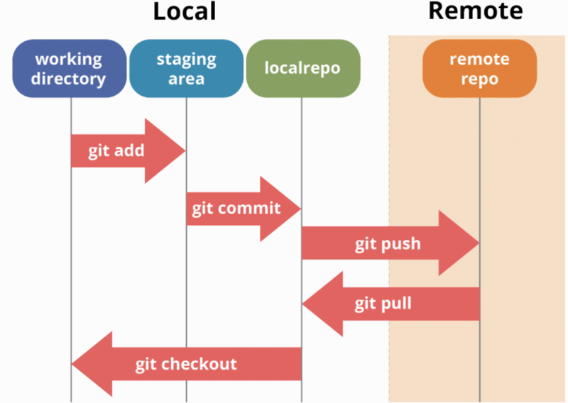

# Git and Github guide
## Quick intro

#### What is Git?
Git is a version control system that tracks changes in your code or files over time, making it easy to collaborate and manage versions.

#### What is GitHub?
GitHub is an online platform for hosting Git repositories, allowing teams to collaborate and manage code in one central location.

#### Key terms
- **Repository (Repo)**: A project folder managed by Git.
- **Working Directory**: The folder on your computer where your project 
  files are located. Files here can be **tracked** (managed by Git) or 
  **untracked** (not yet under Git's control).
- **Staging Area**: A place where changes are prepared (or "staged") before 
  committing.
- **Local Repository**: A database on your computer where Git stores committed changes. 
- **Remote Repository**: A shared repository hosted online (e.g., on GitHub).
Allows team members to collaborate and share changes.
- **Branch**: A separate line of development for working on features 
  independently.
- **Commit**: A snapshot of changes in your project history.
- **Push**: Upload local commits to the remote repository.
- **Pull**: Download changes from the remote repository.

#### Set up Git
```bash
git config --global user.name "Your Name"
git config --global user.email "your.email@example.com"
```
#### Clone our repository
```bash
git clone https://github.com/TianhaoW/AllofQuant
```

## General Workflow
#### Always update your local repo before making changes
```bash
git pull origin main    # Get the most recent version of the main branch
```
#### Make your changes and stage the changes
```bash
git add <file-name>       # This will only stage the file-name to staging area
git add .                 # This will stage all changes 
```
#### Commit your changes with a message
```bash
git commit -m "Describe your changes"
```
#### Push your changes to Github
```bash
git push origin main

# Use the following command if you are working on a different branch
git push origin <your branch name>    
```



## Branches

#### Key terms
- **Branch**: A branch is a lightweight, movable pointer to a commit in your Git repository. The default branch when you initialize a repository is typically called main or master.
- **HEAD**: HEAD is a pointer that represents your current working branch. When you commit, HEAD moves to the latest commit on the active branch.
- **Branching and Merging**: Branches allow you to diverge from the main line of development to work independently. You can later merge the branch back into the main branch or any other branch.
- **Branch Isolation**: Changes made in one branch do not affect other branches, making it safe to experiment or develop features without risking the stability of the main branch.

#### List all branches
```bash
git branch
```
This will list all branches. The current branch is marked with \*

#### Switch to a branch
```bash
git checkout <branch-name>    # old way
git switch <branch-name>      # recommended
```
- The HEAD will point to the latest commit on \<branch-name\>.
- Files tracked in the new branch will overwrite the corresponding files in your working directory.
- Untracked files in your working directory are not affected by the branch switch unless they conflict with files in the new branch.
- The staging area will remain unless there is a conflict.

#### Switch and create a new branch
```bash
git checkout -b <branch-name>     # old way
git switch -c <branch-name>       # recommended
```

#### Stash the working directory and switch branch
```bash
git stash       # This will temporarily store modified tracked files in order to change branches
git switch <branch-name>
git stash pop   # This will recover those changes before switching the branch
```

#### Integrate changes from one branch to another
###### Merge
```bash
# Merge the changes in target branch into the current branch
git merge <branch-name>

# If there are conflict, resolve conflicts first and then:
git add <resolved-files>
git commit

# If the branch being merged is no longer needed, we can delete it
git branch -d <branch-name>
```
- This will merge the changes in \<branch-name\> to the current branch, and create a 'merge' commit.
- The HEAD will remain on the current branch, and the merge commit become the new HEAD.
- The target branches are untouched.
- The working directory is updated to reflect the merged result. If there are conflicts, git will pause the merge.
- Git will mark the files with conflicts. After resolving the conflicts, those files must be staged before completing the merge.
- In practice, we switch to the main branch, and merge the changes in a feature branch into the main branch.
```plaintext
original commit history before merge:
main: A---B---C---D
feature:      E---F
------------------------------------------------------------
git switch main
git merge feature
------------------------------------------------------------
Git merge will create the merged commit M in the main branch
It has all changes from the feature branch
main: A---B---C---D---M
feature:      E---F
```


###### Rebase
```bash
# This will rebase the current branch onto the target branch
git rebase <branch-name>

# If there are conflicts, resolve the conflicts manually and
git add <resolved-files>
git rebase --continue
```
- Moves or "replays" the commits from target branch to current branch.
- Creates a linear history, rewriting the commits as if they were based on the latest commit of the target branch.
- The target branch is unaffected
- Conflicts must be resolved at each commit point

```plaintext
original commit history before rebase:
main: A---B---C---D
feature:      E---F
------------------------------------------------------------
git switch feature
git rebase main
------------------------------------------------------------
Git will rewrite the commit E',F' as they are based in D
main: A---B---C---D
feature:              E'---F'
The HEAD is at F' now
```