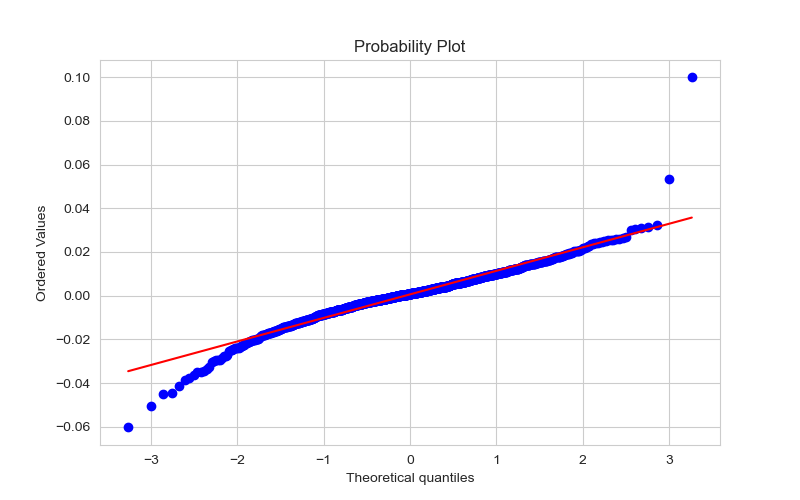

# Fat-Tailed Distributions in Finance

In most classical financial models, we assume that asset prices follow a **Geometric Brownian Motion (GBM)**. This implies that the **log returns** of the asset should be normally distributed.

However, empirical data shows that log returns often follow a **fat-tailed (or heavy-tailed)** distribution instead.

---

### Comparison with the Normal Distribution

The tails of a standard normal distribution decay exponentially as:

$$\mathbb{P}(|X| > x) \sim \exp(-x^2).$$

In contrast, the **empirical distribution of log returns** places significantly more probability mass in the tails. That is:
- **Extreme events** (both large gains and losses) occur **more frequently** than predicted by the normal distribution.
- This results in a distribution with **higher kurtosis** (peaked center and fat tails).

---

### Evidence from Q–Q Plots

Here is the **Q-Q plot** against a normal distribution. We observe:
- **Center of the plot** follows the diagonal.
- **Tails deviate sharply**:
  - Left tail bends downward → more extreme negative returns.
  - Right tail bends upward → more extreme positive returns.

This characteristic **“S-shape”** or **“bowtie shape”** in the Q–Q plot is a signature of fat-tailed behavior.

---

### Causes of Fat Tails in Financial Markets

Fat tails arise due to a variety of real-world factors not captured by simplistic models:

| Cause                        | Explanation                                                                                                               |
|------------------------------|---------------------------------------------------------------------------------------------------------------------------|
| **Information shocks**       | Sudden unexpected news (e.g., geopolitical events, economic reports) can cause large price movements.                     |
| **Liquidity crises**         | In illiquid markets, large orders can have disproportionate price impact, amplifying tail risk.                           |
| **Feedback loops**           | Mechanisms like margin calls or stop-loss cascades can cause rapid price swings.                                          |
| **Herding behavior**         | Investors may imitate each other, amplifying moves in one direction.                                                      |
| **Volatility clustering**    | Periods of low volatility are often followed by high-volatility bursts, leading to heavy tails (often modeled via GARCH). |
| **Leverage and derivatives** | Use of leverage magnifies gains and losses, increasing tail risk.                                                         |

